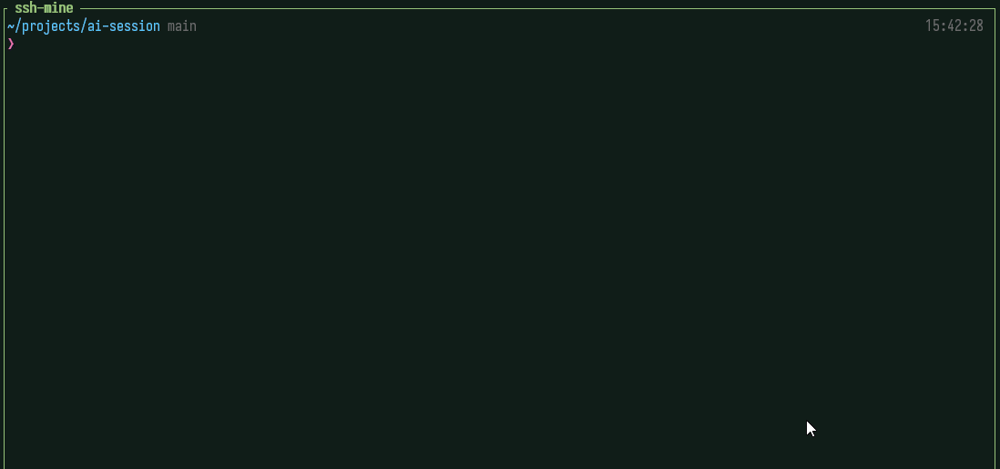

# ai-session



One launcher for several AI CLI accounts: Claude Code, Codex, OpenCode, and
Antigravity. Each profile gets its own state directory, so two accounts never
share a credential file. Each official CLI still handles its own logins and
token refreshes. `ai` never reads, prints, or stores token contents.

| Provider | Isolated through |
| -------- | ---------------- |
| Claude Code | `CLAUDE_CONFIG_DIR` |
| Codex | `CODEX_HOME` |
| OpenCode | `XDG_CONFIG_HOME`, `XDG_DATA_HOME`, `XDG_STATE_HOME` |
| Antigravity | a profile-local `HOME` |

## Install

```sh
./install.sh
```

This builds `ai` from `cmd/ai`. After that, `ai self-update` (or `U` in the
TUI) keeps it current.

## Quickstart

```sh
ai profile add work claude     # make a profile
ai install work                # install its provider's CLI, if missing
ai login work                  # log in through the official CLI
ai work                        # run it (same as: ai run work)
ai                             # or open the TUI
```

`ai run -p work [arguments...]` launches with only those arguments, skipping the
profile's stored defaults. See [doc/running.md](doc/running.md#run).

## What it does

- **Isolated accounts.** Any number of profiles per provider. Claude, Codex, and
  OpenCode profiles can each run in several terminals at once.
- **A TUI cockpit.** One table of every profile, sorted by quota headroom, with
  a gauge per window, its login state, and what it is running; the selected
  account expands in place to show recent work.
- **Resume anything.** `R` reopens any recent conversation in the folder it ran
  in. `h` attaches to one that is still running.
- **Hand off when quota runs out.** `H` turns a conversation into a short brief
  and starts another account on it in the same folder.
- **Shared setup.** Clone a profile, or copy MCP servers and skills between
  profiles, even when they use different providers.
- **Portable.** Export a profile as an `age`-encrypted bundle and import it
  on another machine.

Press `space` (or `?`) in the TUI for every action, with what each would act
on right now.

## Documentation

| Topic | Doc |
| ----- | --- |
| Creating, cloning, and moving profiles; app profiles | [doc/profiles.md](doc/profiles.md) |
| Installing CLIs, logging in, running, concurrency | [doc/running.md](doc/running.md) |
| The TUI: panels, keys, saved arguments | [doc/tui.md](doc/tui.md) |
| Resuming, hijacking, and handing off sessions | [doc/sessions.md](doc/sessions.md) |
| Copying MCP servers and skills | [doc/mcp-and-skills.md](doc/mcp-and-skills.md) |
| Seeing the active profile inside a CLI; OpenUsage | [doc/integrations.md](doc/integrations.md) |
| Update check and self-update | [doc/updates.md](doc/updates.md) |
| How concurrent OpenCode instances work | [doc/opencode-concurrent-instances.md](doc/opencode-concurrent-instances.md) |

## License

MIT. See [LICENSE](LICENSE).
